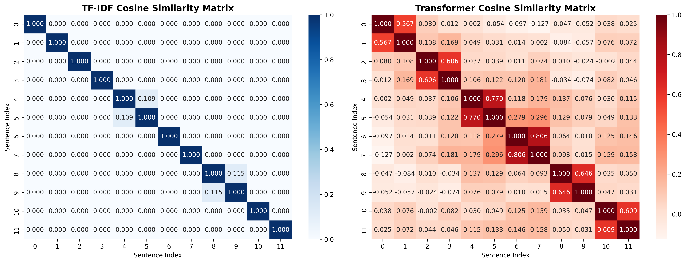
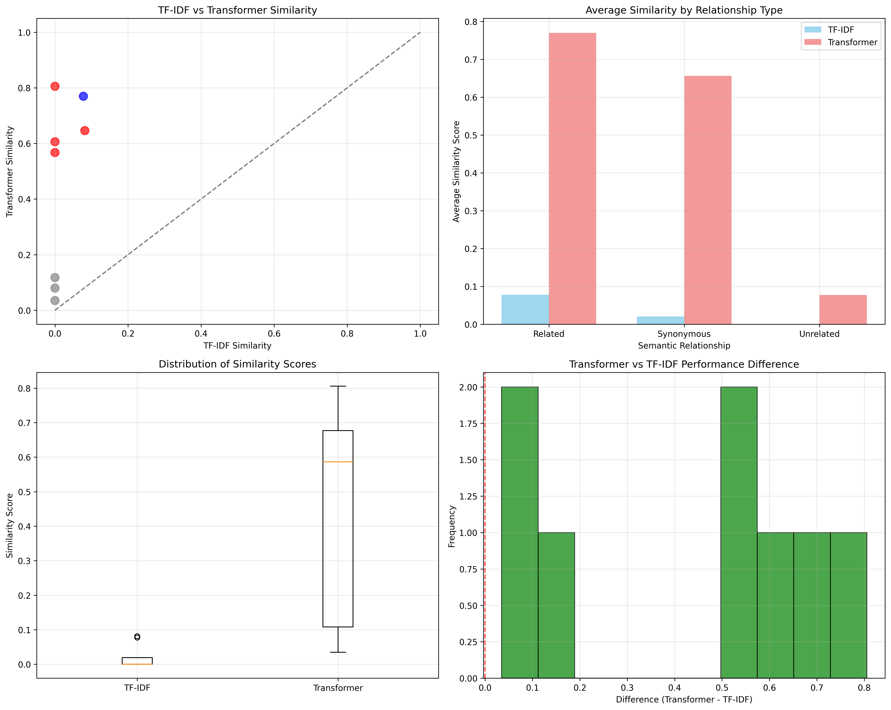
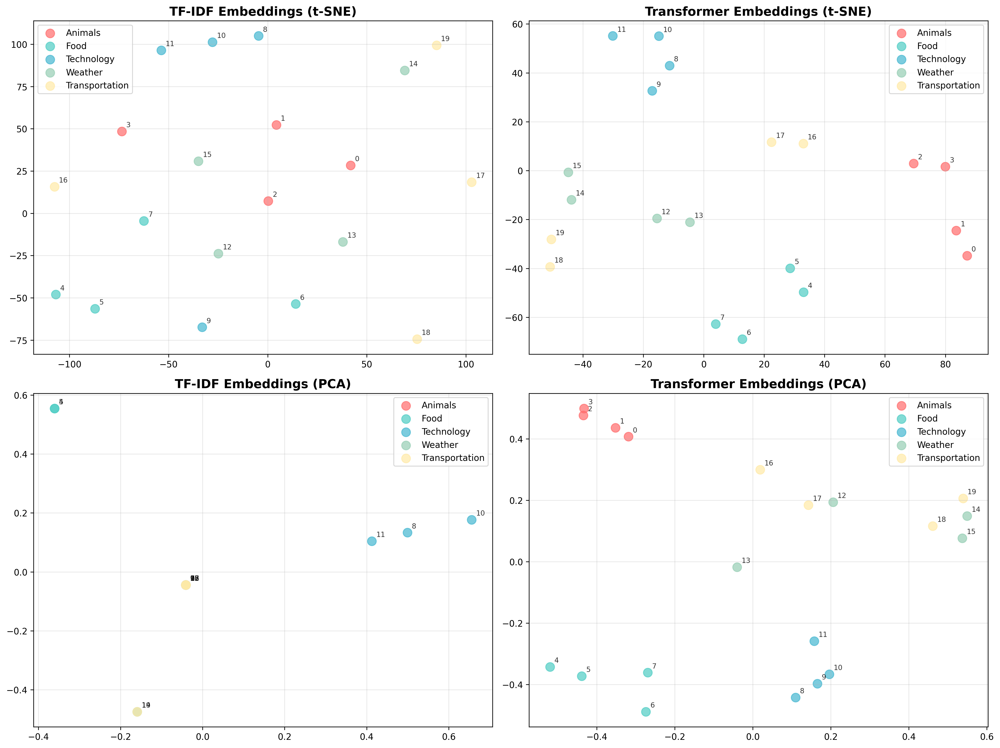
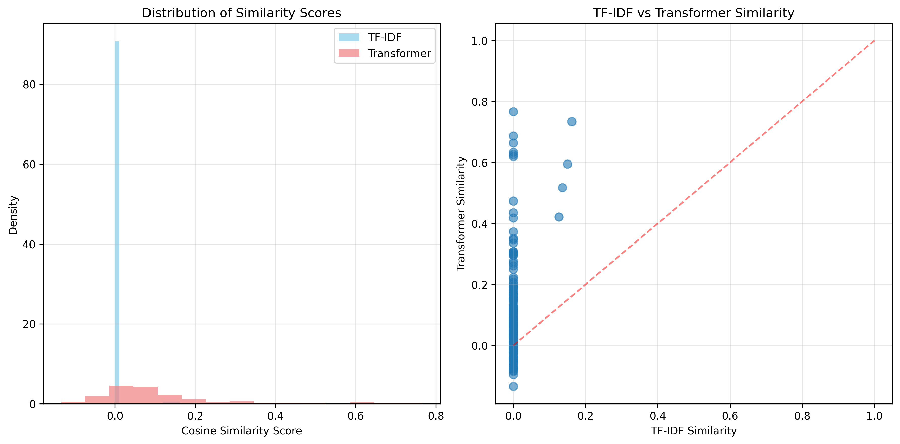
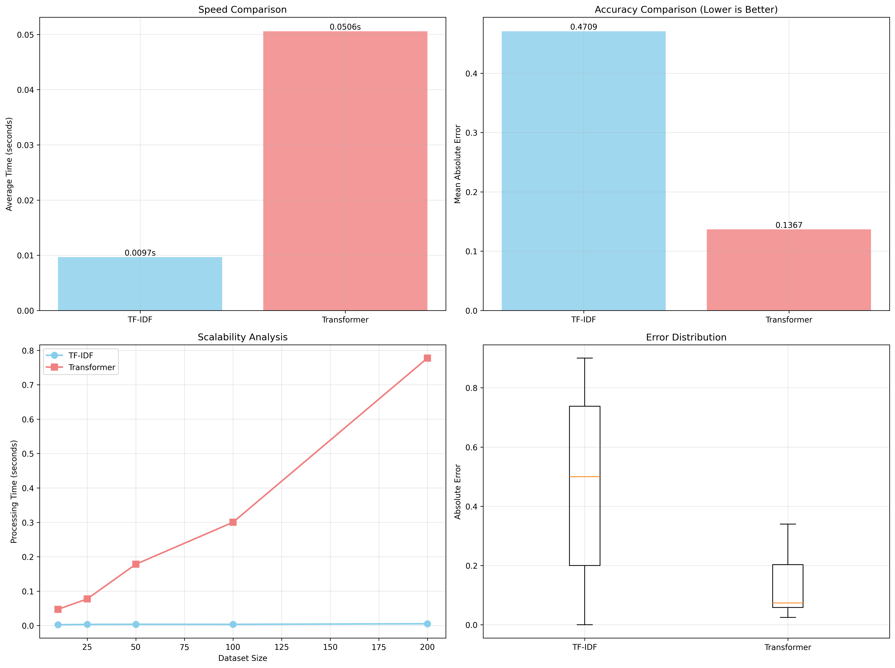

# NLP Similarity Showdown

A comparison of text similarity methods from classical TF-IDF to modern transformer-based embeddings. 

This project demonstrates how different NLP techniques capture semantic relationships and provides detailed analysis with their performance characteristics.

## Project Overview

This project compares two main approaches to text similarity:
- **TF-IDF (Term Frequency-Inverse Document Frequency)**: Classical statistical method
- **Transformers**: Modern DL approach using pre-trained sentence embeddings

The analysis reveals how transformers capture semantic similarity more accurately than traditional methods, especially for sentences with similar meanings but with different vocabulary.

## Project Structure

```
nlp-similarity-showdown/
├── similarity_comparison.py      # Main comparison script
├── interactive_demo.py          # Interactive testing interface
├── embedding_visualizer.py      # Embedding visualization tools
├── benchmark_methods.py         # Performance benchmarking
├── utils.py                     # Utility functions
├── requirements.txt             # Python dependencies
├── README.md                    # This file
└── outputs/                     # Generated visualizations and reports
    ├── similarity_matrices_comparison.png
    ├── method_comparison_analysis.png
    ├── embedding_visualizations.png
    ├── benchmark_results.png
    └── similarity_comparison_results.csv
    └── accuracy_analysis.csv
    └── benchmark_report.md
    └── PROJECT_REPORT.md
    └── similarity_distributions.png
```

## Installation

1. Clone the repository:
```bash
git clone https://github.com/RamuNalla/NLP-similarity-showdown.git
cd NLP-similarity-showdown
```

2. Create a virtual environment (recommended):
```bash
python -m venv nlp_env
source nlp_env\Scripts\activate
```

3. Install dependencies:
```bash
pip install -r requirements.txt
```

##  Quick Start

### Run Complete Analysis
```bash
python similarity_comparison.py
```
This will generate:
- Similarity matrix heatmaps
- Detailed comparison results
- Performance visualizations
- CSV file with all results

### Interactive Demo
```bash
python interactive_demo.py
```
Test with own sentence pairs and verify real-time similarity comparisons

### Embedding Visualization
```bash
python embedding_visualizer.py
```
Visualize how different methods represent sentences in vector space.

### Performance Benchmarking
```bash
python benchmark_methods.py
```
Compare speed, accuracy, and scalability of different methods.


##  Sample Results

### Similarity Comparison Example

| Sentence 1 | Sentence 2 | TF-IDF | Transformer | Semantic Relationship |
|------------|------------|---------|-------------|----------------------|
| "The cat is sleeping on the sofa" | "A feline is resting on the couch" | 0.0000 | 0.5672 | Synonymous |
| "I love eating pizza for dinner" | "Pizza is my favorite meal in the evening" | 0.0778 | 0.7696 | Related |
| "Machine learning is fascinating" | "The car broke down on the highway" | 0.0817 | 0.6461 | Synonymous |


### Key Findings

 **Semantic Understanding**: Transformers excel at recognizing semantic similarity even when sentences use completely different vocabulary (e.g., "cat/feline", "sofa/couch").

 **Speed vs Accuracy Trade-off**: TF-IDF is ~5-10x faster but significantly less accurate for semantic similarity tasks.

 **Scalability**: Both methods scale well, but transformers have higher computational overhead for large datasets.


 ## Performance Metrics

The project evaluates methods using:
- **Cosine Similarity**: Primary similarity metric
- **Mean Absolute Error**: Accuracy against ground truth
- **Processing Speed**: Time to compute similarities
- **Correlation Analysis**: How well methods agree with each other

##  Visualizations Generated

1. **Similarity Matrix Heatmaps**: Visual comparison of similarity matrices



2. **Method Performance Charts**: Speed vs accuracy analysis



3. **Embedding Scatter Plots**: 2D visualization of sentence embeddings



4. **Distribution Analysis**: Statistical distribution of similarity scores



5. **Scalability Curves**: Performance vs dataset size




### Model Information
- **Sentence Transformer Model**: `all-MiniLM-L6-v2`
  - 22.7M parameters
  - 384-dimensional embeddings
  - Trained on 1B+ sentence pairs


###  Results Summary

The project demonstrates that:
1. **Transformers consistently outperform TF-IDF** for semantic similarity tasks
2. **TF-IDF remains valuable** for speed-critical applications
3. **Method choice depends on requirements**: accuracy vs speed trade-offs
4. **Visualization helps understand** how different methods represent text
